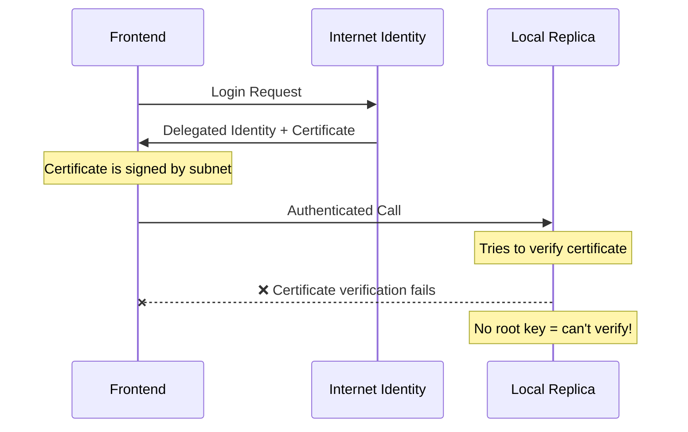
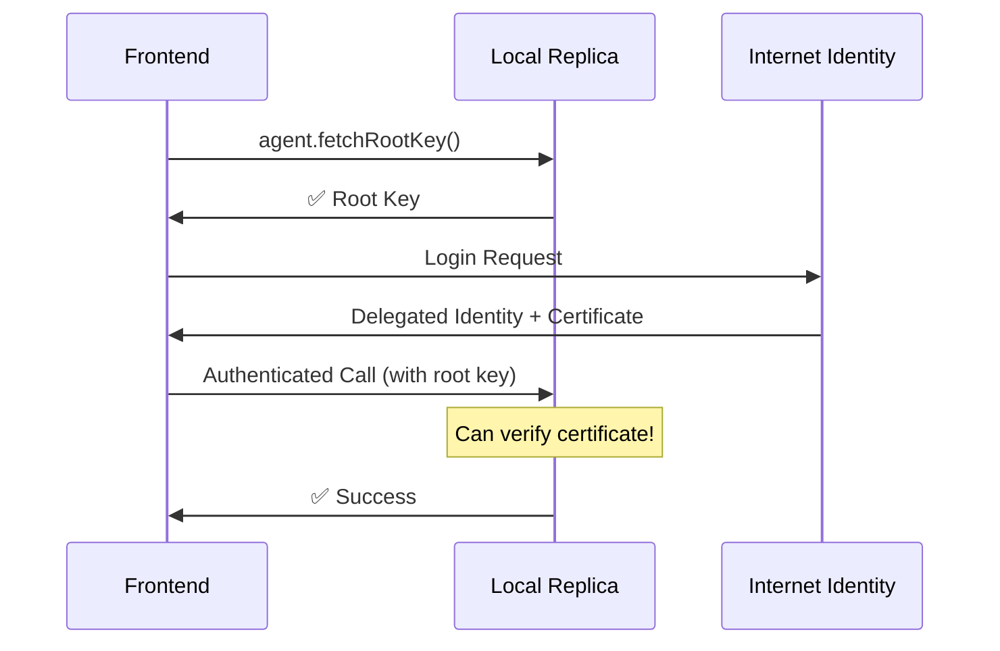

# Root Key Fix - Certificate Verification Issue

## Problem
Error: `Invalid delegation: Invalid canister signature: IcCanisterSignature signature could not be verified`

## Root Cause
When using **Internet Identity with local dfx**, authenticated calls fail because:
1. Internet Identity creates a **delegated identity** 
2. The delegation certificate needs to be verified against the **root key**
3. In local development, the root key is NOT available by default
4. Without `agent.fetchRootKey()`, certificate verification fails

## Solution Implemented

### 1. Force Root Key Fetch in Actor Creation
File: `lib/ic/ironcladActor.ts`

```typescript
// ALWAYS fetch root key when host is localhost
const isLocalHost = IC_CONFIG.host.includes('localhost') || IC_CONFIG.host.includes('127.0.0.1');

if (isLocalHost && !IC_CONFIG.isProduction()) {
  await agent.fetchRootKey();
}
```

### 2. Centralized Configuration
File: `lib/ic/config.ts`

```typescript
export const IC_CONFIG = {
  host: process.env.NEXT_PUBLIC_IC_HOST ?? 'http://127.0.0.1:4943',
  ironcladCanisterId: process.env.NEXT_PUBLIC_IRONCLAD_VAULT_BACKEND_CANISTER_ID ?? 'u6s2n-gx777-77774-qaaba-cai',
  internetIdentityCanisterId: process.env.NEXT_PUBLIC_INTERNET_IDENTITY_CANISTER_ID ?? 'rdmx6-jaaaa-aaaaa-aaadq-cai',
}
```

### 3. No Hardcoded Values
All canister IDs now come from `IC_CONFIG` which reads from environment variables.

## How to Test

### ⚠️ IMPORTANT: Clear Old Session First!

The old delegation was created WITHOUT root key fetch. You MUST logout and login again:

1. **Disconnect Wallet**:
   - Click "Disconnect" button in header
   - This clears localStorage

2. **Connect Again**:
   - Click "Connect Wallet"
   - Choose "Internet Identity"
   - Login again

3. **Verify in Console**:
   You should see:
   ```
   [Ironclad Actor] 🔑 Fetching root key for local development...
   [Ironclad Actor] ✅ Root key fetched - certificates will verify correctly
   ```

4. **Check Data Loads**:
   - Vaults should load without errors
   - Auto-reinvest configs should load
   - Marketplace listings should load

## Environment Variables Required

`.env.local`:
```env
NEXT_PUBLIC_IC_HOST=http://127.0.0.1:4943
NEXT_PUBLIC_IRONCLAD_VAULT_BACKEND_CANISTER_ID=u6s2n-gx777-77774-qaaba-cai
NEXT_PUBLIC_INTERNET_IDENTITY_CANISTER_ID=rdmx6-jaaaa-aaaaa-aaadq-cai
```

## Files Changed

1. ✅ `lib/ic/ironcladActor.ts` - Force fetch root key for localhost
2. ✅ `lib/ic/config.ts` - Added `internetIdentityCanisterId`
3. ✅ `components/wallet/WalletProvider.tsx` - Use `IC_CONFIG` instead of hardcoded values

## Technical Details

### Why This Happens



### With Root Key Fetch



## Security Note

⚠️ **NEVER** call `fetchRootKey()` in production!

This is only for local development. In mainnet/production:
- The root key is hardcoded in the agent
- Certificate verification works automatically
- Calling `fetchRootKey()` would be a security vulnerability

Our code checks:
```typescript
const isLocalHost = IC_CONFIG.host.includes('localhost') || IC_CONFIG.host.includes('127.0.0.1');
if (isLocalHost && !IC_CONFIG.isProduction()) {
  // Only fetch for local development
}
```

## Verification Checklist

After logout + re-login:

- [ ] No "Invalid delegation" errors in console
- [ ] Vaults load successfully
- [ ] Auto-reinvest configs load
- [ ] Marketplace listings load  
- [ ] Can create vault
- [ ] Can execute canister calls

## Common Issues

### Issue: Still seeing errors after fix
**Solution**: Make sure you **disconnected wallet** and **logged in again**. Old session has invalid delegation.

### Issue: Root key not fetching
**Solution**: Check console logs. Should see "🔑 Fetching root key". If not, verify `IC_CONFIG.host` contains "localhost".

### Issue: Works locally but breaks in production
**Solution**: Our check `isLocalHost && !isProduction()` ensures root key is ONLY fetched in local dev.
